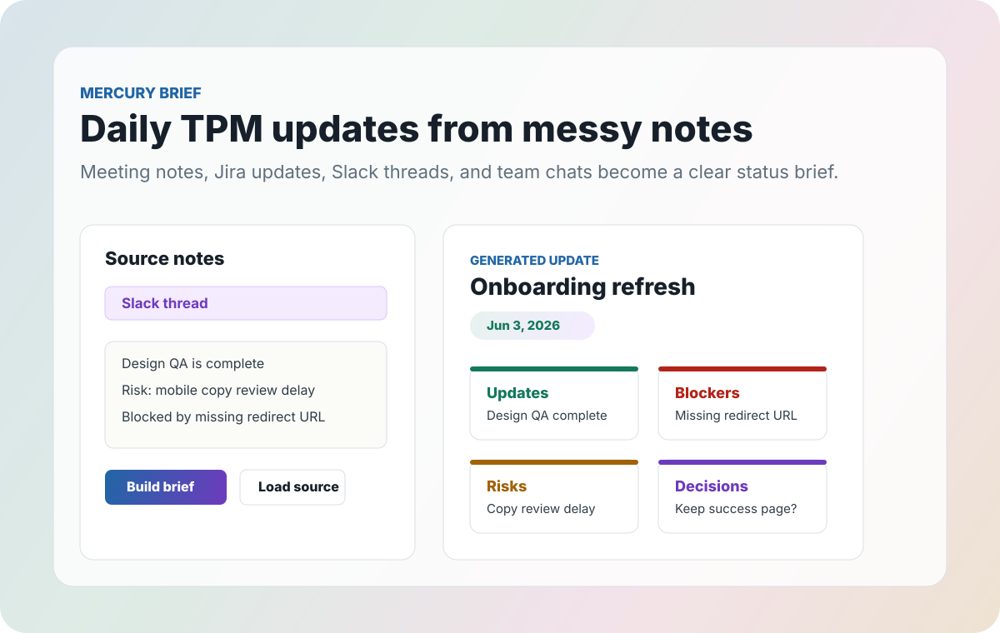

# Mercury




Mercury is a lightweight workspace for practical TPM tools.

## Mercury Brief

Mercury Brief is a small React + Vite app that turns messy TPM source notes into a
structured daily status update. Paste notes from Slack, standup, Jira, meeting
docs, or team chats, then generate an editable brief with updates, actions,
risks, blockers, and decisions.

## Demo Flow

1. Pick an example source: meeting notes, Jira updates, Slack thread, or team
   chat.
2. Choose the daily update date from the form or the generated-panel calendar.
3. Build the brief.
4. Review color-coded updates, actions, risks, blockers, and decisions.
5. Copy the editable summary into Slack, email, or a status doc.

## Features

- Selectable example sources for meeting notes, Jira updates, Slack threads, and
  team chats.
- Daily update date support with synced date controls in the input form and the
  generated update panel.
- Custom right-panel calendar popover for choosing the generated update date.
- Local browser persistence for the latest project, date, and source notes.
- Copyable/editable output ready for Slack, email, or status docs.
- Color-coded status sections for faster TPM scanning.

## Why It Helps

TPM updates often start as scattered fragments: a Jira ticket here, a Slack
reply there, a decision buried in meeting notes. Mercury Brief gives those
fragments a repeatable daily shape, so the final update is easier to scan,
share, and act on.

## Run locally

Install dependencies, then start the Vite dev server.

```bash
npm install
npm run dev
```

Vite will print the local URL, usually `http://localhost:5173`.

In GitHub Codespaces, open the forwarded Vite port after running `npm run dev`.

## Deploy on Vercel

Vercel can import this repository as a Vite app from GitHub.

- Framework preset: `Vite`
- Build command: `npm run build`
- Output directory: `dist`
- Install command: `npm install`

After the GitHub repository is connected to Vercel, pushes, PRs, and merges can
produce automatic preview or production deployments.

## Validate

```bash
npm test
npm run build
```

The test uses mock TPM inputs from Slack, meetings, Jira, and team chats to
verify note classification and generated date formatting.
